# Proofsy - Rental Booking System with Blockchain Verification

## 🚀 Live Demo & App

- **🎥 Demo Video**: [Watch Demo on Loom](https://www.loom.com/share/6000ec18327c49378b3b41780766c970?sid=937f9a40-22bd-4373-a6d6-995d9bfac117)
- **🌐 Live Application**: [Try Proofsy Live](https://proofsy-by-number-protocol.up.railway.app/#)

## Overview 

**Proofsy** is a responsive web application for recording rental/service processes (property booking, check-in, inspection, and check-out) to the Numbers Mainnet blockchain using the ERC-7053 standard. Every step is recorded transparently, securely, and can be verified in the future with support for photo/video evidence uploads that can be verified using C2PA (Coalition for Content Provenance and Authenticity).

## 🎯 Key Features

- **Blockchain Recording**: Every event recorded to Numbers Mainnet with ERC-7053 standard
- **Timeline View**: Complete event history for each booking with on-chain verification
- **Media Evidence Upload**: Upload photos/videos with C2PA verification for visual proof
- **Database Persistence**: PostgreSQL database with Prisma ORM for reliable storage
- **Transparent Proof**: Every event has transaction hash and asset NID for verification
- **Explorer Links**: Direct links to blockchain explorer for verification
- **Responsive Design**: Web application accessible from desktop and mobile
- **Real-time Status**: System status monitoring and Capture API connection

## 🏗️ System Architecture Diagram

```mermaid
graph TB
    subgraph "Frontend Layer"
        UI[Web UI<br/>Bootstrap 5 + JavaScript]
        Form[Event Creation Form]
        Timeline[Timeline View]
        PhotoUpload[Photo Upload<br/>with C2PA]
    end
    
    subgraph "Backend Layer - Express.js"
        API[REST API Server<br/>Port 5000]
        EventAPI[/api/events]
        MediaAPI[/api/media]
        HealthAPI[/api/health]
        Validation[Input Validation<br/>& Idempotency Check]
    end
    
    subgraph "Data Layer"
        Prisma[Prisma ORM]
        DB[(PostgreSQL Database)]
        Uploads[File Storage<br/>/uploads/]
    end
    
    subgraph "Blockchain Layer"
        Numbers[Numbers Protocol<br/>Capture API]
        Mainnet[Numbers Mainnet<br/>ERC-7053]
        Explorer[Blockchain Explorer<br/>verify.numbersprotocol.io]
    end
    
    UI --> Form
    UI --> Timeline
    UI --> PhotoUpload
    
    Form -->|POST /api/events| EventAPI
    PhotoUpload -->|POST /api/media| MediaAPI
    Timeline -->|GET /api/events| EventAPI
    
    EventAPI --> Validation
    MediaAPI --> Validation
    
    Validation -->|Store Event| Prisma
    Validation -->|Submit to Blockchain| Numbers
    MediaAPI -->|Save File| Uploads
    
    Prisma --> DB
    
    Numbers -->|Commit ERC-7053| Mainnet
    Mainnet -->|Return NID + TxHash| Numbers
    Numbers -->|Blockchain Proof| EventAPI
    
    Timeline -->|Verify NID| Explorer
    
    DB -.->|EventPersist<br/>MediaFile| Prisma
    
    style UI fill:#e1f5ff
    style API fill:#fff4e1
    style DB fill:#f0e1ff
    style Numbers fill:#e1ffe1
    style Mainnet fill:#ffe1e1
```

## 🔄 Event Submission Flow

```mermaid
sequenceDiagram
    participant User as 👤 User<br/>(Landlord/Tenant)
    participant Frontend as 🖥️ Frontend
    participant Backend as ⚙️ Backend API
    participant Prisma as 📊 Prisma ORM
    participant DB as 💾 PostgreSQL
    participant Numbers as 🔗 Numbers API
    participant Blockchain as ⛓️ Numbers Mainnet
    participant Explorer as 🔍 Explorer

    User->>Frontend: 1. Fill Event Form<br/>(BookingCreated, CheckIn, etc.)
    Frontend->>Backend: 2. POST /api/events<br/>{eventType, metadata, actor}
    
    Backend->>Backend: 3. Generate Idempotency Key
    Backend->>Backend: 4. Validate Input<br/>(bookingId, propertyId, actor)
    
    Backend->>Prisma: 5. Check Duplicate<br/>(idempotencyKey)
    Prisma->>DB: Query EventPersist
    DB-->>Prisma: No duplicate found
    
    Backend->>Numbers: 6. Submit to Capture API<br/>POST /assets/
    Note over Numbers: ERC-7053 Format:<br/>{data, source, metadata}
    
    Numbers->>Blockchain: 7. Commit to Mainnet<br/>(Async Transaction)
    Blockchain-->>Numbers: 8. Return workflow_id<br/>(pending commit)
    Numbers-->>Backend: 9. Response<br/>{nid, txHash, status}
    
    Backend->>Prisma: 10. Store Event
    Prisma->>DB: INSERT EventPersist<br/>(nid, txHash, metadata)
    DB-->>Prisma: ✅ Stored
    
    Backend-->>Frontend: 11. Success Response<br/>{eventId, nid, txHash}
    Frontend-->>User: 12. Show Success + Timeline
    
    User->>Frontend: 13. Click "Verify on Blockchain"
    Frontend->>Explorer: 14. Open Explorer<br/>verify.numbersprotocol.io/asset/{nid}
    Explorer-->>User: 15. Show Blockchain Proof<br/>(Transaction, Metadata, History)
    
    Note over User,Explorer: ✅ Event Permanently Recorded on Blockchain!
```



## 📁 Project Structure

### Backend (Node.js/Express)
```
server/
├── index.js              # Proofsy main server file
├── package.json          # Dependencies
├── .env                  # Environment configuration
├── uploads/              # Media files storage
├── prisma/
│   ├── schema.prisma     # Database schema
│   ├── dev.db           # SQLite database
│   └── migrations/      # Database migrations
├── src/services/
│   └── store.js         # Database service layer
└── node_modules/        # Dependencies
```

### Frontend (HTML/CSS/JavaScript)
```
public/
├── index.html            # Proofsy main application UI
└── app.js               # Frontend JavaScript logic
```

### Event Schema
```
EVENT_SCHEMA.md          # Complete event schema documentation
```

## 📋 Event Types

### 1. BookingCreated
Event when booking is first created with tenant and property details.

### 2. CheckInConfirmed  
Event when check-in is confirmed by host with property condition.

### 3. InspectionLogged
Event when property inspection is performed with detailed checklist.

### 4. CheckOutConfirmed
Event when check-out is confirmed with final property condition.

## 🚀 Quick Start

### Prerequisites
- Node.js 18+ 
- Numbers Protocol API Key ([Get it here](https://verify.numbersprotocol.io/))

### Local Development

1. **Clone Repository**
```bash
git clone https://github.com/yourusername/proofsy.git
cd proofsy
```

2. **Install Dependencies**
```bash
npm install
```

3. **Configure Environment**
```bash
# Copy .env.example to server/.env
cp .env.example server/.env

# Edit server/.env with your Numbers Protocol API key
NUMBERS_API_KEY=your_api_key_here
```

4. **Setup Database**
```bash
npm run migrate:dev
```

5. **Start Development Server**
```bash
npm run dev
```

6. **Access Application**
Open browser: `http://localhost:5000`

---

## 🚂 Railway Deployment (Recommended)

### One-Click Deploy to Railway

[](https://railway.app/new/template?template=https://github.com/yourusername/proofsy)

### Manual Deployment Steps

1. **Push to GitHub**
```bash
git init
git add .
git commit -m "Initial commit"
git remote add origin https://github.com/yourusername/proofsy.git
git push -u origin main
```

2. **Create Railway Project**
- Go to [Railway.app](https://railway.app)
- Click "New Project" → "Deploy from GitHub repo"
- Select your `proofsy` repository
- Railway will auto-detect and deploy!

3. **Configure Environment Variables**

In Railway Dashboard, add these variables:
```bash
NUMBERS_API_KEY=your_numbers_protocol_api_key
USE_NUMBERS_LIVE=true
NUMBERS_API_BASE=https://api.numbersprotocol.io/api/v3
NODE_ENV=production
```

4. **Access Your Deployed App**
- Railway provides a public URL: `https://proofsy-production.up.railway.app`
- Your app is now live! 🎉

### Railway Features
- ✅ **Auto-Deploy**: Every git push triggers deployment
- ✅ **Persistent Storage**: SQLite database persists across deploys
- ✅ **HTTPS**: Automatic SSL certificate
- ✅ **$5 Free Credit/Month**: ~500 hours runtime
- ✅ **Zero Cold Start**: Always responsive
- ✅ **Environment Variables**: Secure secret management

### Railway CLI (Optional)

Install Railway CLI for advanced features:
```bash
# Install CLI
npm i -g @railway/cli

# Login
railway login

# Deploy from terminal
railway up

# View logs
railway logs
```

---

## 🔧 Alternative Deployment Options

### Render (Free Tier with Auto-Sleep)
- Auto-sleep after 15 minutes inactivity
- Cold start delay (~30-60s)
- Database resets on restart (not recommended for production)

### Vercel + Backend Separately
- Deploy frontend to Vercel
- Deploy backend to Railway/Render
- Configure CORS and environment variables

### VPS (DigitalOcean, AWS EC2)
- Full control over infrastructure
- Manual setup required
- Nginx reverse proxy + PM2 process manager

## 🔧 API Endpoints

### Health Check
```http
GET /api/health
```
Response:
```json
{
  "status": "OK",
  "mode": "LIVE",
  "timestamp": "2025-10-13T11:04:44.245Z",
  "capture": {
    "baseURL": "https://api.numbersprotocol.io/api/v3",
    "isConfigured": true
  }
}
```

### Submit Event
```http
POST /api/events
Headers:
  Content-Type: application/json
  Idempotency-Key: unique_key_here

Body:
{
  "event": {
    "eventType": "BookingCreated",
    "bookingId": "book_demo_1",
    "propertyId": "prop_A",
    "actor": "0xabc123...",
    "occurredAt": "2025-10-15T01:00:00Z",
    "metadata": {
      "renterName": "Ayu",
      "price": "120",
      "currency": "USDC"
    },
    "idempotencyKey": "evt_01HABC"
  }
}
```

### Get Timeline
```http
GET /api/events?bookingId=book_demo_1
```
Response:
```json
{
  "bookingId": "book_demo_1",
  "events": [
    {
      "id": "uuid-here",
      "eventType": "BookingCreated",
      "actor": "0xabc123...",
      "occurredAt": "2025-10-15T01:00:00Z",
      "receivedAt": "2025-10-13T11:04:44.245Z",
      "metadata": {...},
      "captureTxHash": "0x123...abc",
      "captureNid": "nid_123456789",
      "links": {
        "tx": "https://explorer.numbers.example/tx/0x123...abc",
        "asset": "https://explorer.numbers.example/asset/nid_123456789"
      }
    }
  ]
}
```

### Upload Media Evidence
```http
POST /api/media/upload
Content-Type: multipart/form-data

Form Data:
- media: (file) Photo/Video file
- uploadedBy: (string) Uploader name/wallet
- bookingId: (string) Associated booking ID
```

Response:
```json
{
  "success": true,
  "mediaId": "media_123456",
  "file": {
    "id": "media_123456",
    "originalName": "property_photo.jpg",
    "fileName": "media-1705123456789-123456789.jpg",
    "fileSize": 2048576,
    "mimeType": "image/jpeg",
    "url": "/uploads/media-1705123456789-123456789.jpg",
    "uploadedAt": "2025-10-13T13:16:33.000Z",
    "verified": false
  },
  "message": "File uploaded successfully. C2PA verification pending."
}
```

### Verify Media with C2PA
```http
POST /api/media/:mediaId/verify
Content-Type: application/json

Body:
{
  "c2paSignature": "c2pa_signature_here"
}
```

### Get Media Files
```http
GET /api/media?bookingId=book_demo_1
```

Response:
```json
{
  "bookingId": "book_demo_1",
  "mediaFiles": [
    {
      "id": "media_123456",
      "originalName": "property_photo.jpg",
      "fileName": "media-1705123456789-123456789.jpg",
      "fileSize": 2048576,
      "mimeType": "image/jpeg",
      "c2paSignature": "verified_signature",
      "captureCid": "QmHash...",
      "captureTxHash": "0x123...abc",
      "captureNid": "nid_123456789",
      "verified": true,
      "uploadedBy": "0xabc123...",
      "bookingId": "book_demo_1",
      "url": "/uploads/media-1705123456789-123456789.jpg",
      "links": {
        "tx": "https://explorer.numbers.example/tx/0x123...abc",
        "asset": "https://explorer.numbers.example/asset/nid_123456789"
      }
    }
  ]
}
```

## 🔗 Capture API Integration

### Configuration
```javascript
const CAPTURE_CONFIG = {
  baseURL: 'https://api.numbersprotocol.io/api/v3',
  apiKey: 'your_capture_token',
  commitPath: '/nit/commits',
  getNidPath: '/nit/assets/',
  queryPath: '/nit/search',
  isLive: true
};

const EXPLORER_CONFIG = {
  txBase: 'https://explorer.numbers.example/tx/',
  assetBase: 'https://explorer.numbers.example/asset/'
};
```

### Database Schema
```prisma
model EventPersist {
  id              String   @id @default(cuid())
  idempotencyKey  String   @unique
  bookingId       String
  propertyId      String
  eventType       String
  actor           String
  occurredAt      DateTime
  metadataJson    String
  mediaCid        String?
  txHash          String
  nid             String
  chain           String
  createdAt       DateTime @default(now())
  @@index([bookingId])
  @@index([nid])
}

model MediaFile {
  id              String   @id @default(cuid())
  originalName    String
  fileName        String
  filePath        String
  fileSize        Int
  mimeType        String
  c2paSignature   String?
  captureCid      String?
  captureTxHash   String?
  captureNid      String?
  verified        Boolean  @default(false)
  uploadedBy      String
  bookingId       String?
  eventId         String?
  createdAt       DateTime @default(now())
  updatedAt       DateTime @updatedAt
  @@index([bookingId])
  @@index([eventId])
  @@index([captureCid])
}
```

### Event Submission Format
```javascript
const captureData = {
  data: {
    eventType: eventData.eventType,
    bookingId: eventData.bookingId,
    propertyId: eventData.propertyId,
    actor: eventData.actor,
    occurredAt: eventData.occurredAt,
    metadata: eventData.metadata,
    idempotencyKey: idempotencyKey
  },
  source: {
    id: `booking-${eventData.bookingId}`,
    name: 'Proofsy - Rental Booking System'
  }
};
```

## 🎨 Frontend Features

### Dashboard
- System status monitoring
- Real-time connection to Capture API
- LIVE/TEST mode indicator

### Event Creation
- Form to create new events
- Sample data for testing
- Real-time validation

### Timeline View
- Visual timeline with event cards
- Blockchain proof display (txHash + NID)
- Event metadata visualization
- Explorer links for verification
- Responsive design for mobile

### Media Upload & Gallery
- Upload photos/videos with preview
- C2PA verification for file provenance
- Media gallery with verification status
- Blockchain proof for media files
- Explorer links for verified media

## 🔒 Security Features

- **Idempotency**: Prevents duplicate event processing
- **Input Validation**: Data validation before blockchain submission
- **File Upload Security**: File type and size limit validation
- **C2PA Verification**: Content provenance verification for media files
- **Database Encryption**: SQLite with Prisma ORM for data integrity
- **Error Handling**: Graceful error handling for network issues
- **CORS**: Configured for cross-origin requests

## 📱 Mobile Responsive

Application uses Bootstrap 5 for responsive design:
- Mobile-first approach
- Touch-friendly interface
- Optimized for various screen sizes
- Progressive Web App ready

## 🧪 Testing & Demo

### Sample Events
Application provides sample data for testing:
- Sample Booking Created
- Sample Check-In Confirmed  
- Sample Inspection Logged
- Sample Check-Out Confirmed

### Demo Workflow
1. Open application in browser
2. Use "Quick Actions" to load sample data
3. Submit event to blockchain
4. Upload media evidence with preview
5. View timeline with blockchain proof
6. View media gallery with verification status
7. Verify transaction hash and NID
8. Click explorer links for on-chain verification

## 🔍 Verification

Every event and media file recorded can be verified with:

### Event Verification
- **Transaction Hash**: For verification on blockchain explorer
- **Asset NID**: For querying event details on Numbers Protocol
- **Metadata**: Complete event information in JSON format
- **Timestamps**: Event time and recording time
- **Explorer Links**: Direct links to blockchain explorer

### Media Verification
- **C2PA Signature**: Content provenance verification
- **File Hash**: Integrity verification
- **Capture CID**: IPFS hash for file storage
- **Blockchain Proof**: Transaction hash and NID for media
- **Verification Status**: Real-time verification status

## 📊 Monitoring

### System Status
- API connection status
- Capture API configuration
- LIVE/TEST mode indicator
- Real-time error reporting

### Event Tracking
- Event submission status
- Blockchain confirmation
- Timeline completeness
- Error logging

## 🛠️ Development

### Project Structure
```
Proofsy/
├── server/
│   ├── index.js              # Express server with API endpoints
│   ├── package.json          # Dependencies
│   ├── .env                  # Environment configuration
│   ├── uploads/              # Media files storage directory
│   ├── prisma/
│   │   ├── schema.prisma     # Database schema (EventPersist, MediaFile)
│   │   ├── dev.db           # SQLite database file
│   │   └── migrations/      # Database migration files
│   └── src/services/
│       └── store.js         # Database service layer
├── public/
│   ├── index.html           # Proofsy main UI with media upload form
│   └── app.js              # Frontend logic with media handling
├── EVENT_SCHEMA.md         # Event documentation
└── README.md               # This file
```

### Key Technologies
- **Backend**: Node.js, Express.js
- **Frontend**: HTML5, CSS3, JavaScript (ES6+)
- **UI Framework**: Bootstrap 5
- **Icons**: Font Awesome 6
- **Database**: SQLite with Prisma ORM
- **File Upload**: Multer for multipart handling
- **Blockchain**: Numbers Protocol Capture API
- **Content Verification**: C2PA (Coalition for Content Provenance and Authenticity)
- **Standard**: ERC-7053

## 📝 License

MIT License - see LICENSE file for details.

## 🤝 Contributing

1. Fork the repository
2. Create feature branch
3. Commit changes
4. Push to branch
5. Create Pull Request

## 📸 Media Evidence & C2PA Integration

### C2PA (Coalition for Content Provenance and Authenticity)
Application supports C2PA standard for media file origin and integrity verification:

- **Content Provenance**: Metadata about file origin and device
- **Digital Signatures**: Cryptographic proof for verification
- **Tamper Detection**: File modification detection
- **Blockchain Integration**: C2PA signature stored on blockchain

### Supported Media Types
- **Images**: JPG, PNG, GIF
- **Videos**: MP4, MOV, AVI, WEBM
- **File Size Limit**: 50MB per file
- **Auto Preview**: Real-time preview before upload

### Verification Process
1. **Upload**: File uploaded with metadata
2. **C2PA Signing**: File receives digital signature
3. **Blockchain Proof**: Signature stored on Numbers Protocol
4. **Verification**: Real-time verification status
5. **Explorer Links**: Direct links for on-chain verification

## 🚀 Advanced Features

### Database Persistence
- **SQLite Database**: Local storage with Prisma ORM
- **Event Persistence**: All events stored permanently
- **Media Metadata**: Complete media file details
- **Indexing**: Optimized queries with database indexes

### API Rate Limiting & Security
- **File Validation**: Type and size validation
- **Error Handling**: Comprehensive error handling
- **CORS Configuration**: Secure cross-origin requests
- **Input Sanitization**: Data validation and sanitization

### Real-time Features
- **Live Status**: Real-time system status monitoring
- **Progress Indicators**: Upload progress and loading states
- **Error Feedback**: Immediate error feedback
- **Success Notifications**: Real-time success notifications

## 📞 Support

For questions or support about **Proofsy**:
- Email: support@proofsy.app
- Documentation: [Numbers Protocol Docs](https://docs.numbersprotocol.io/)
- API Reference: [Capture API Docs](https://docs.numbersprotocol.io/capture-api)
- C2PA Documentation: [C2PA.org](https://c2pa.org/)

---

**Proofsy - Built with ❤️ for transparent rental tracking on Numbers Mainnet with C2PA verification**

